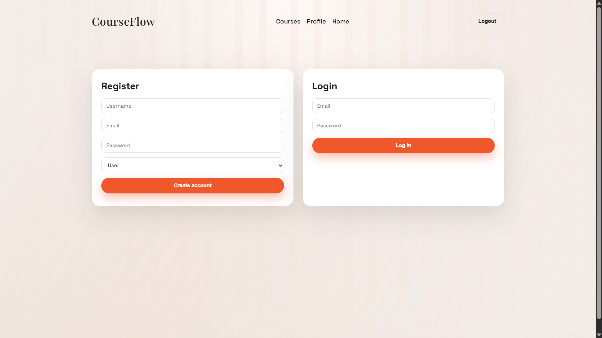
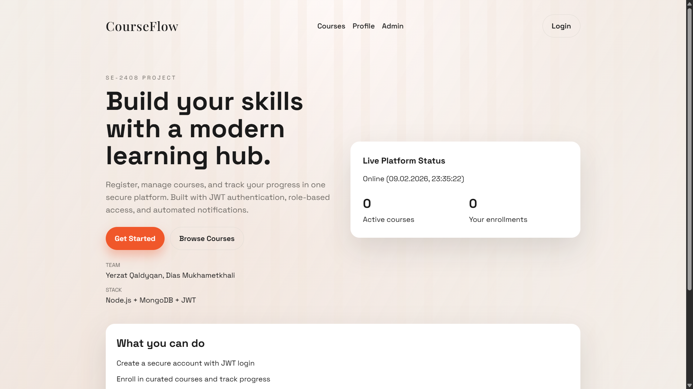
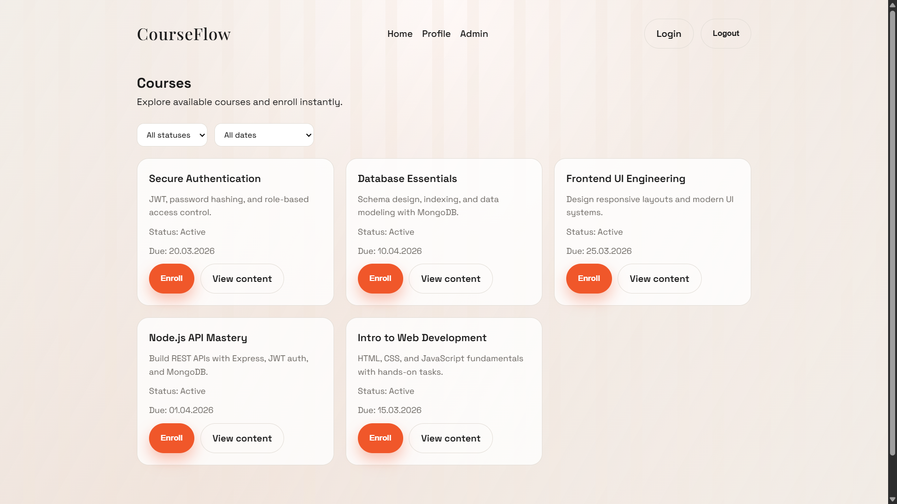
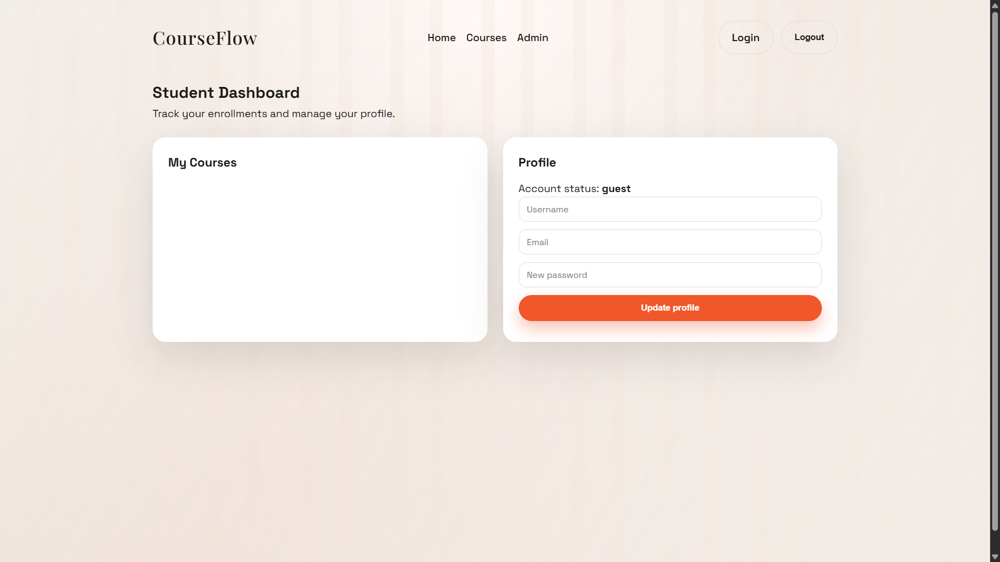
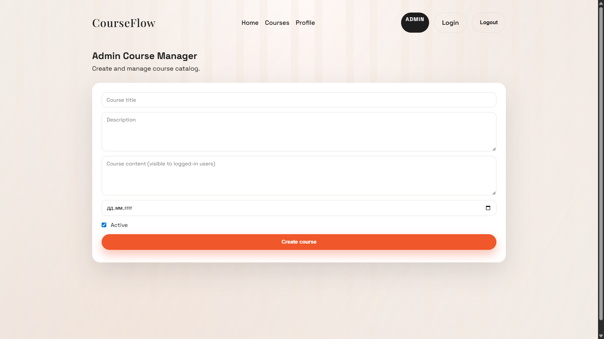

# Online Courses Website

Online Courses platform with JWT authentication, RBAC, course management, and enrollments. Built with Node.js, Express, and MongoDB.

## Project overview

- Secure registration/login with JWT
- Role-based access: admin, moderator, premium, user
- Course catalog + enrollment tracking
- SMTP email notifications (optional)
- Separate pages for Home, Auth, Courses, Profile, Admin

## Setup

1. Install dependencies:

```
npm install
```

2. Create `.env` from the template:

```
copy .env.example .env
```

3. Start MongoDB locally, then run:

```
npm run dev
```

Open http://localhost:5000

## Seed courses

```
npm run seed
```


## API Documentation

Auth (Public)
- POST `/register`
- POST `/login`

User Profile (Private)
- GET `/users/profile`
- PUT `/users/profile`

Course Resource (Private)
- POST `/resource` (admin, moderator)
- GET `/resource`
- GET `/resource/:id`
- PUT `/resource/:id` (admin, moderator)
- DELETE `/resource/:id` (admin)

Course Catalog (Public)
- GET `/resource/public`

Enrollment (Private)
- POST `/enroll/:courseId`
- GET `/my-courses`
- PUT `/my-courses/:courseId/modules`

## Screenshots

Home page — Landing and status



Auth page — Registration and login



Courses page — Course catalog



Profile page — Profile and enrolled courses



Admin page — Course management



## Deployment

- Use Render/Railway/Replit
- Set environment variables (`MONGO_URI`, `JWT_SECRET`, SMTP keys)
- Use the deployed URL in your final submission

### Example (Render)
1. Push the project to GitHub.
2. Create a new Web Service on Render.
3. Set Build Command: `npm install`
4. Set Start Command: `npm start`
5. Add environment variables from `.env.example`.
6. Deploy and copy the public URL.

Deployed URL: <ADD_YOUR_DEPLOYED_URL_HERE>
GitHub Repo: <ADD_YOUR_GITHUB_REPO_URL_HERE>

